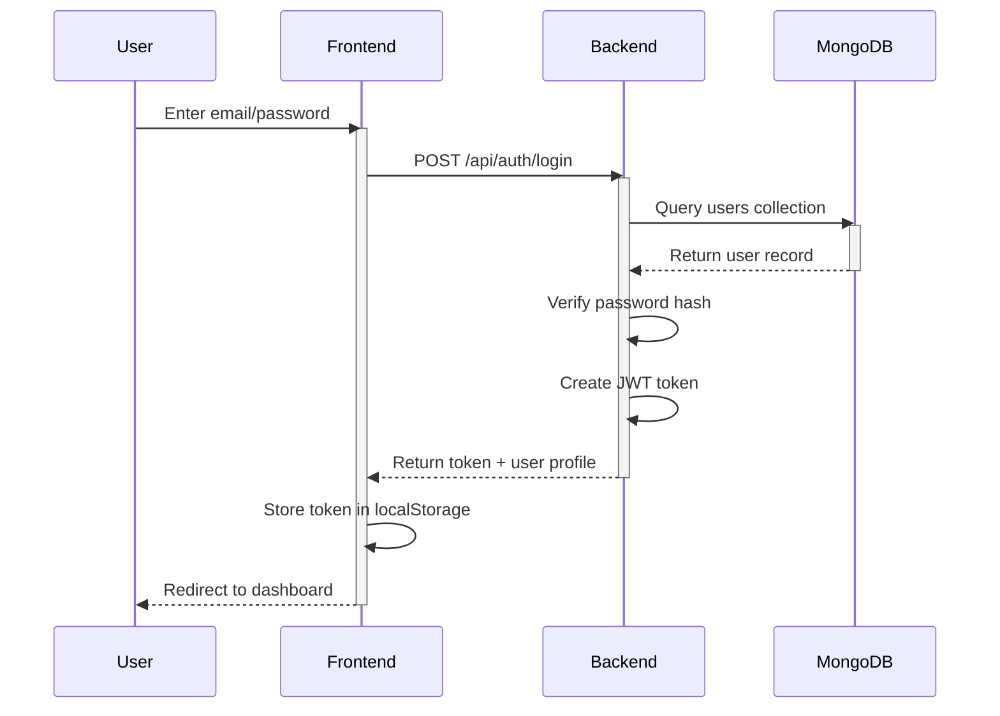
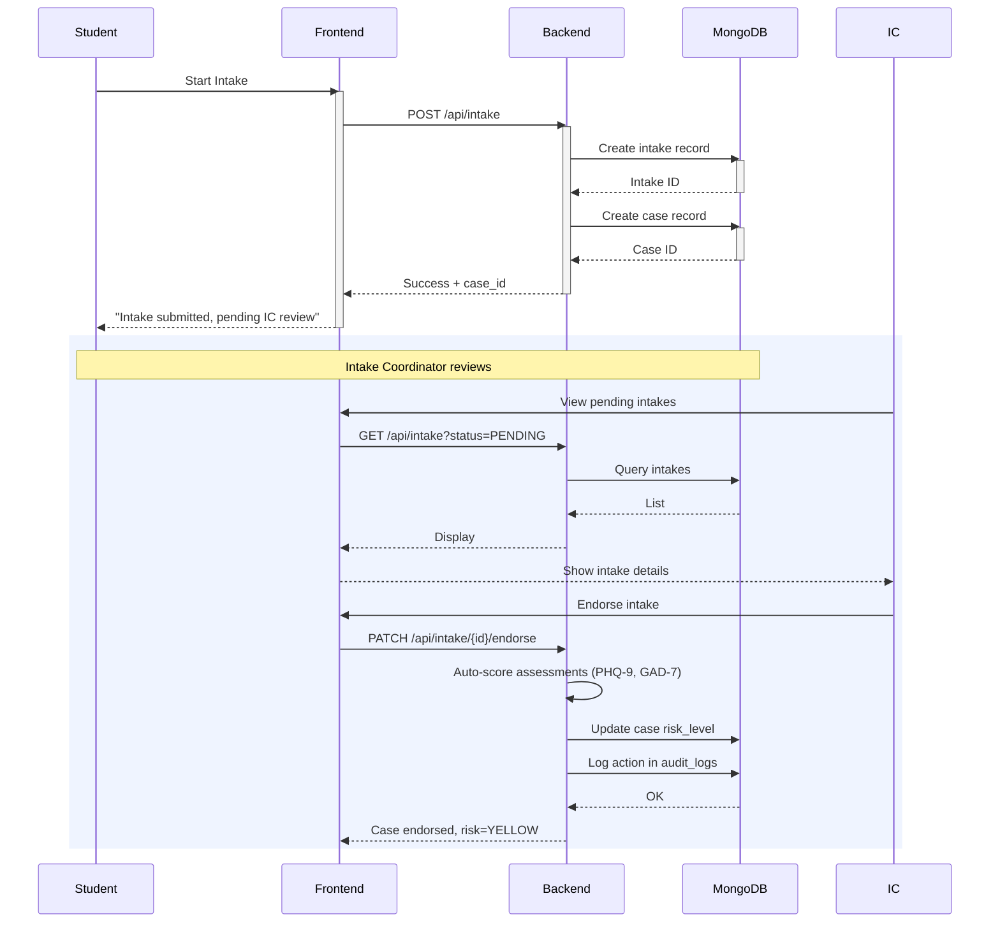
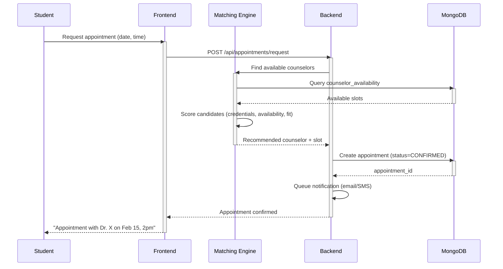
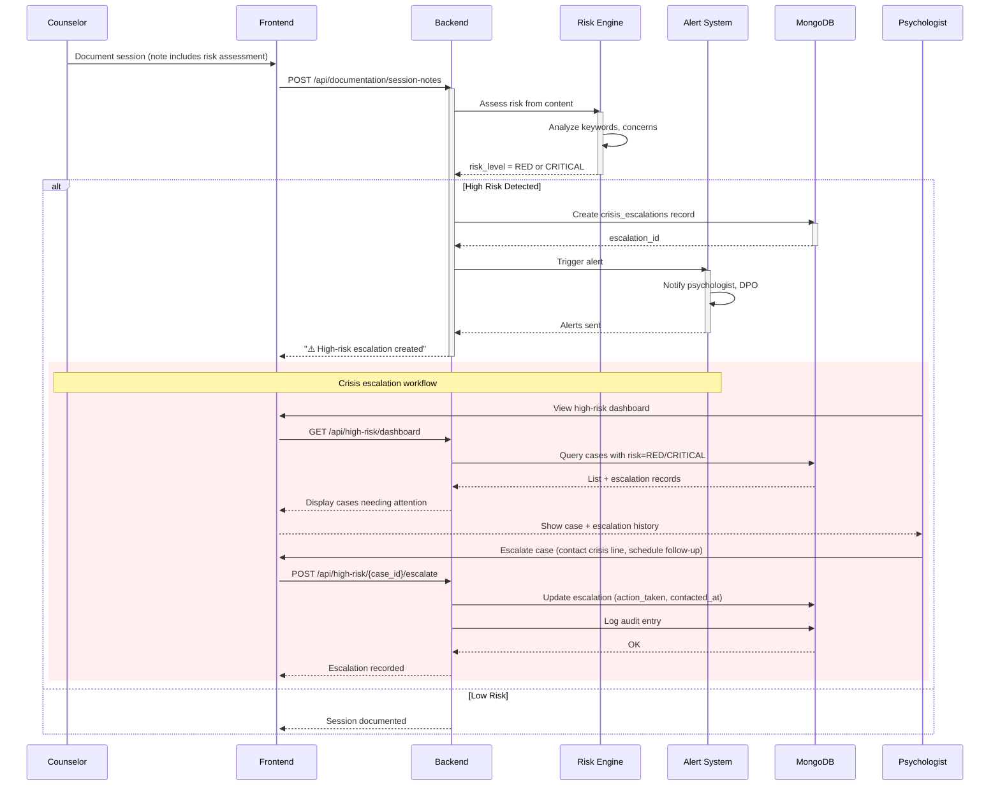
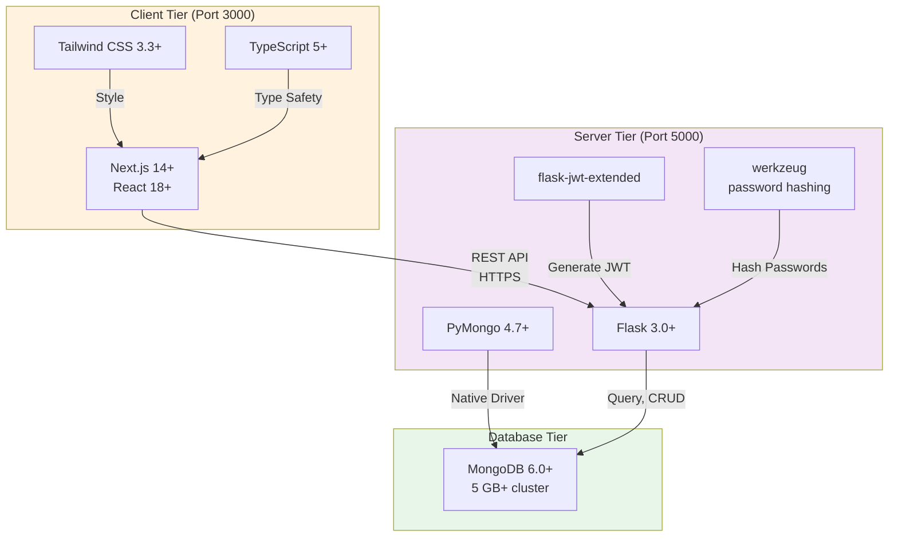

# System Architecture Diagram

## System Components & Data Flow

```mermaid
graph TB
    subgraph Users["👥 Users / Clients"]
        Student["Student"]
        Counselor["Counselor<br/>Psychologist"]
        IC["Intake Coordinator"]
        Admin["Admin<br/>DPO"]
    end

    subgraph Frontend["Frontend Layer<br/>Next.js + React + Tailwind"]
        LoginPage["Login / Register<br/>Pages"]
        Dashboard["Dashboard<br/>Caseload View"]
        IntakePage["Intake<br/>Questionnaire"]
        BookingPage["Appointment<br/>Booking"]
        DocumentationUI["Session<br/>Documentation"]
        RiskUI["Risk<br/>Dashboard"]
    end

    subgraph Backend["Backend Layer<br/>Flask + Python"]
        AuthSvc["Auth Service<br>/api/auth"]
        IntakeSvc["Intake Service<br>/api/intake"]
        AppointmentSvc["Appointment Service<br>/api/appointments"]
        DocumentationSvc["Documentation Service<br>/api/documentation"]
        RiskSvc["Risk Monitoring<br>/api/high-risk"]
        ReferralSvc["Referral Service<br>/api/referrals"]
        AuditSvc["Audit & Logging<br>/api/audit-logs"]
    end

    subgraph Database["Database Layer<br/>MongoDB"]
        Users[("users")]
        Cases[("cases")]
        Intakes[("intakes")]
        Assessments[("assessments")]
        Appointments[("appointments")]
        Sessions[("session_notes")]
        Referrals[("referrals")]
        AuditLogs[("audit_logs")]
        Escalations[("crisis_escalations")]
    end

    subgraph External["External & Notifications"]
        EmailSvc["Email Service<br/>(Future: SendGrid)"]
        SMSSvc["SMS Service<br/>(Future: Twilio)"]
        CrisisLine["Crisis Hotline<br/>Reference"]
    end

    Student -->|Login<br/>View Case<br/>Book Apt| Frontend
    Counselor -->|Login<br/>View Cases<br/>Document| Frontend
    IC -->|Login<br/>Triage<br/>Endorse| Frontend
    Admin -->|Login<br/>Manage Users<br/>View Audit| Frontend

    LoginPage -->|JWT Auth| AuthSvc
    IntakePage -->|Submit Form| IntakeSvc
    BookingPage -->|Request Slot| AppointmentSvc
    DocumentationUI -->|Write Note| DocumentationSvc
    RiskUI -->|View Status| RiskSvc
    Dashboard -->|View Risk| RiskSvc

    AuthSvc -->|CRUD Users| Users
    IntakeSvc -->|Create Intakes| Intakes
    IntakeSvc -->|Create Cases| Cases
    AppointmentSvc -->|Manage Appointments| Appointments
    AppointmentSvc -->|Assess Risk| Assessments
    DocumentationSvc -->|Store Notes| Sessions
    RiskSvc -->|Query Escalations| Escalations
    ReferralSvc -->|Manage Referrals| Referrals
    AuditSvc -->|Log Actions| AuditLogs

    AuthSvc -->|Log Access| AuditLogs
    DocumentationSvc -->|Log Edits| AuditLogs

    RiskSvc -->|Send Alert| EmailSvc
    AppointmentSvc -->|Send Reminder| SMSSvc
    RiskSvc -->|Escalate| CrisisLine

    style Users fill:#e1f5ff
    style Frontend fill:#fff3e0
    style Backend fill:#f3e5f5
    style Database fill:#e8f5e9
    style External fill:#fce4ec
```

---

## Detailed Service Interactions

### 1. Authentication Flow

### 2. Intake & Triage Workflow

### 3. Appointment Booking & Matching

### 4. Risk Monitoring & Escalation

---

## Data Flow: Student Perspective

```mermaid
graph LR
    A["Student Creates<br/>Account"] -->|Register| B["Authentication<br/>JWT Issued"]
    B -->|Login| C["Student Dashboard"]
    C -->|Start Intake| D["Fill Questionnaire<br/>PHQ-9, GAD-7, History"]
    D -->|Submit| E["Intake Pending<br/>IC Review"]
    E -->|IC Endorses| F["Case In Progress<br/>Risk Level Assigned"]
    F -->|Request Appt| G["Appointment<br/>With Counselor"]
    G -->|Complete Session| H["Session Note<br/>Added to Case"]
    H -->|Follow-ups| I["Ongoing Treatment"]
    I -->|If Needed| J["Referral to<br/>External Provider"]
    J -->|WarmHandoff| K["Warm Transfer<br/>to External Care"]
```

---

## Technology Stack Interaction

---

**Diagram Generated:** February 10, 2026  
**Architecture Version:** 1.0
